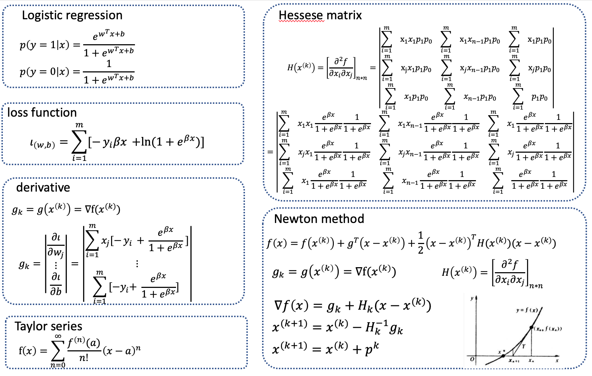

# mljs
## Basic knowledge.

+ [AUC](AUC.md)  
+ [Entropy and Gini index](entropy.md)  
+ [Linear regression](linear.md)  
+ [Logistic Regression](logistic.md)  
+ [Newton method](newton.md)  

## Code
+ [Outline](code_md/outline.md) 

[app](https://github.com/xug15/mljs/releases/tag/v1.0.0)


**1. First get data from html.**  
**getinforvalue(trainid)**
> Use the div id get the data.
```js
function getinforvalue(trainid){
  //var trainid='training_decision';
  //get the html data
  if(typeof datacontents==="undefined"){
    var decision_data=document.getElementById(trainid).value;
  }else if(datacontents.length>0){
    var decision_data=datacontents;
  }else{
    var decision_data=document.getElementById(trainid).value;
  }
  
  //decision_label=document.getElementById("label_decision").value;

  //transforme data formate.
  var data=decision_data.split('\n');
  var dataarr=[];
  for(var i=0;i<data.length;i++){
    var row=[];
    row=data[i].split(',').map(function(item) {
	return parseFloat(item);
  });
    dataarr.push(row);
  }
  //console.log(dataarr);

  return dataarr;

}
// getinforvalue('training_decision')
```
**getinforlabel(lableid)**  
> Use the div id get the label data.
```js  
function getinforlabel(){
  //get the html data
  //decision_data=document.getElementById("training_decision").value;
  var lableid='label_decision';
  if(typeof labelcontents==="undefined"){
    var decision_label=document.getElementById(lableid).value;
  }
  else if(labelcontents.length>0){
    var decision_label=labelcontents;
  }else{
    var decision_label=document.getElementById(lableid).value;
  }


  //transforme data formate.

  var decision_label_a=decision_label.split('\n').map(function(item) {
	return parseFloat(item);
  })
  console.log(decision_label_a);
  return decision_label_a;
}
```
**2. Then use function sort label information.**  
**sort_unique(arr)**
> sort and unique the array, and return the unique array.
```js
var label_unique=sort_unique(label);
function sort_unique(arr2) {
  var arr=JSON.parse(JSON.stringify(arr2));
  if (arr.length === 0) return arr;
  arr = arr.sort(function (a, b) { return a*1 - b*1; });
  var ret = [arr[0]];
  for (var i = 1; i < arr.length; i++) { //Start loop at 1: arr[0] can never be a duplicate
    if (arr[i-1] !== arr[i]) {
      ret.push(arr[i]);
    }
  }
  return ret;
}
```

**3. Merge data and label to one matrix.**  
**merge_matrix(data,label)**
> Make two array to one array.
```js
function merge_matrix(a2,b2){
  a=JSON.parse(JSON.stringify(a2));
  b=JSON.parse(JSON.stringify(b2));
  var c=[];
for(var i=0;i<a.length;i++){

  a[i].push(b[i]);
  c.push(a[i]);
}
return c;
}
```

**4. Shuffle array to generate random array.**  
**shufflearray(merge_array)**
> shuffle array and return the shuffled array.
```js
merge_array=shufflearray(merge_array);
function shufflearray(a2) {
  var a=JSON.parse(JSON.stringify(a2));
    var j, x, i;
    for (i = a.length - 1; i > 0; i--) {
        j = Math.floor(Math.random() * (i + 1));
        x = a[i];
        a[i] = a[j];
        a[j] = x;
    }
    return a;
}
```
**5. Set train and validate range. like train 0-0.8, validate: 0.8-1**  
****
> Set the train data range. like train_range_ratio=[0,0.8]; then, calculate the range the start number and end number.
```js
var train_range_ratio=[0,0.8];
var validate_range_ratio=[0.8,1];
var train_range=[];
var validate_range=[];
var number=parseInt(train_range_ratio[1]*(data.length)) ;

//train_range_ratio[1]*(data.length);
train_range.push(parseInt(train_range_ratio[0]*(data.length)));
train_range.push(parseInt(train_range_ratio[1]*(data.length)));
//
validate_range.push(parseInt(validate_range_ratio[0]*(data.length)));
validate_range.push(parseInt(validate_range_ratio[1]*(data.length)));
```
**6. Use the partion of the set and generate train and validate.**  
**generate_train_validate_data(label_unique,train_range,merge_array)**  
> give the label unique array, and train data range, and the merge array. It will return the relative data array.
```js
//
var train=generate_train_validate_data(label_unique,train_range,merge_array);
var trainingData =train[0];
var trainingLabel=train[1];
var valide=generate_train_validate_data(label_unique,validate_range,merge_array);
var validateData=valide[0];
var validateLabel=valide[1];

function generate_train_validate_data(label_unique,train_range,merge_array)
{
var trainingData=[];
var trainingLabel=[];
var number_train=0;
if(label_unique.length>1)
  {
    for(var j=0;j<label_unique.length;j++)
    {
      trainingData.push([label_unique[j],[]]);
      trainingLabel.push([label_unique[j],[]]);
      for(var i=train_range[0]; i < train_range[1]; i++)
      {
        var row = [];
        for(var k=0;k<merge_array[i].length-1;k++)
          {
            row.push(merge_array[i][k]);
          }
        var label=0;
        if(merge_array[i][merge_array[i].length-1]==label_unique[j])
          {
            
            label=1;
          }else
          {
            label=0;
          }
        row.push(label);
        trainingData[j][1].push(row);
        trainingLabel[j][1].push(label);
      }
    }
  }
return [trainingData,trainingLabel];
}
```
## 2. train model
> 1. use serial learning ratio with 100 iteration to test the best learning ratio.
> 2. use the best learning ratio use serial iterations to select best iterations.
> 3. use the best learning ratio and iteration to generate the model.


**train_model(trainingData[0][1]);**
> use the function train_model(trainingData[0][1]) to train the best model.  
> this function use other functions.  
> loop_learning(learning_ratio,3000,trainingData);  
> trainlogistic(learn_ratio,best_iteration,3,trainingData);  

```js
// train and return model.
function train_model(trainingData){
  var learning_ratio=[1,0.1,0.01,0.001,0.0001,0.00001,0.000001,0.0000001,0.00000001];
  var iteration_array=[100,500,1000,1500,2000,2500,3000,3500];
  var acca=loop_learning(learning_ratio,3000,trainingData);
  console.log(acca);
  var learn_ratio=learning_ratio[indexOfMax(acca)];
  var best_ratio=learn_ratio;
  console.log("index of max "+indexOfMax(acca)+" best learning ratio:"+learning_ratio[indexOfMax(acca)]+"\n\n");
  var acca_iteration=[];
for(var i=0;i<iteration_array.length;i++){
  console.log(iteration_array[i]);
  var a=trainlogistic(learn_ratio,iteration_array[i],0,trainingData);
  acca_iteration.push(a);
}
  var best_iteration=iteration_array[indexOfMax(acca_iteration)];
  console.log("Best iteration:"+best_iteration+" Best ratio:"+best_ratio);
  var modelbest=trainlogistic(learn_ratio,best_iteration,3,trainingData);
  return modelbest;
}
```

**trainlogistic(a,b,c,data)**
> use this function to train logistic regression model. a is the learning ratio, b is iteration, c is report other information or not c default is false,c=0 report accurarcy; c=2 is, report predict probability,  c=3,report classifier, data is the train data.

```js
function trainlogistic(a,b,c,data)
{
  //a is learning ration
  //b is iterations
  //c is report other information or not c default is false,c=0 report accurarcy; c=2 is, report predict probability,  c=3,report classifier, 
  // data is the train data.

  
  if(b===undefined){
    b=100;
  }
  if(c===undefined){
    c=false;
    d=false;
  }else if(c==0)
  {
    c=false;
    d=false;
  }else if(c==2){
    c=true;
    d=true;
  }else if(c==3){
    c=false;
    d=3;
  }
  else{
    console.log(a);
    c=true;
    d=false;
  }
  classifier = new LSRE.LogisticRegression({
   alpha: a,
   iterations: b,
   lambda: 0.0
});

result = classifier.fit(data);

if(c){
  console.log(result);
}
  var probability=[];
  var correct=0;
  var wronge=0;
  for(var i=0; i < data.length; ++i){
   var predicted_probability = classifier.transform(data[i]);
   var predicted = classifier.transform(data[i]) >= classifier.threshold ? 1 : 0;
   /*
   if(c){
    console.log("probability:"+predicted_probability+" predict:"+predicted+" label:"+data[i][data[i].length-1]);
   }
   */
  probability.push(predicted_probability);


   if(data[i][data[i].length-1]==predicted){
    correct++;
   }else{
     wronge++;
   }
   //console.log(" actual: " + merge_array[i][4] + " predicted: " + predicted);
  }
  var ratio=correct/(correct+wronge);

  console.log("Accuracy: "+ratio);
  if(d==3){
    return classifier;
  }else if(d){
    return probability;
  }else{
    return ratio;
  }
  
}
```


**1. use serial learning ratio with 100 iteration to test the best learning ratio.**   
**loop_learning(learning_ratio,3000,trainingData);**  
> This function use the learning ratio array. use the each learning ratio and return the accuracy.
```js

function loop_learning(a,b,c){
  //a is learning ratio array.
  //b is iteration
  //c is data.
  //d is function.
  var acca=[];
  for (var i=0;i<a.length;i++){
    var acc=trainlogistic(a[i],b,0,c);
    acca.push(acc);
  }
  return acca;
}
  var learning_ratio=[1,0.1,0.01,0.001,0.0001,0.00001,0.000001,0.0000001,0.00000001];
  var iteration_array=[100,500,1000,1500,2000,2500,3000,3500];
  var acca=loop_learning(learning_ratio,3000,trainingData);
  console.log(acca);
  var learn_ratio=learning_ratio[indexOfMax(acca)];
  var best_ratio=learn_ratio;
  console.log("index of max "+indexOfMax(acca)+" best learning ratio:"+learning_ratio[indexOfMax(acca)]+"\n\n");
```
**2. use the best learning ratio use serial iterations to select best iterations.**  
> use the different iteration and select highest iterations.
```js
  var acca_iteration=[];
for(var i=0;i<iteration_array.length;i++){
  console.log(iteration_array[i]);
  var a=trainlogistic(learn_ratio,iteration_array[i],0,trainingData);
  acca_iteration.push(a);
}
  var best_iteration=iteration_array[indexOfMax(acca_iteration)];
```
**3. use the best learning ratio and iteration to generate the model.**  

```js
  var modelbest=trainlogistic(learn_ratio,best_iteration,3,trainingData);
  return modelbest;
```
## 3. model data probability.
> loop the validate data use classifier to predict the probability.
> 1. use the best model, and validate data, and for each validate and calculate the probability.

**1. use the best model, and validate data, and for each validate and calculate the probability.**  
**model_data_probability(a,b)**  
> a is the model
> b is the validate data, were used to predict the probability.
```js
function model_data_probability(a,b)
{
//a is the model
//b is validate data.
var proarr=[];
for(var i =0;i<b.length;i++)
  {
    var pro=a.transform(b[i]);
    proarr.push(pro);
  }
  return proarr;
}
```


## 4. mljs validate
> 1. According to the probability and sort and unique the data. Caculate the between the value threshold.
> 2. determine the label by the thresthold.
> 3. according to label in fact and the label predict.

```js
rocarray=mljs_validate(proarr,validateLabel[0][1]);
function mljs_validate(probability,trainingLabel){
  var cutoffarray=cutoff(probability);
console.log(probability);
console.log(cutoffarray);
roc_array_label=mljs_determin_label(probability,cutoffarray);
roc_tp4=mljs_label_cross(trainingLabel,roc_array_label);
return roc_tp4;
}
```

**1. According to the probability and sort and unique the data. Caculate the between the value threshold.**  
**cutoff(probability);**  
> 1. Deep copy probability array.
> 2. sort the probability from small to big.
> 3. Unique the probability.
> 4. Calculate the therthold the first one is the smallest -1, other is the (data[i]+data[i+1])/2

```js
var cutoffarray=cutoff(probability);
function cutoff(arr2) {
  arr=JSON.parse(JSON.stringify(arr2));
  if (arr.length === 0) return arr;
  arr = arr.sort(function (a, b) { return a*1 - b*1; });
  var ret = [arr[0]];
  for (var i = 1; i < arr.length; i++) { //Start loop at 1: arr[0] can never be a duplicate
    if (arr[i-1] !== arr[i]) {
      ret.push(arr[i]);
    }
  }
  var cutoff=[];
  cutoff.push(ret[0]-1);
  for(var i=1;i<ret.length;i++){
    cutoff.push((ret[i-1]+ret[i])/2);
  }
  cutoff.push(ret[ret.length-1]+1);
  return cutoff;
}
```
**2. determine the label by the thresthold.**  
**mljs_determin_label(probability,cutoffarray)**
> 
> 
> 
```js
roc_array_label=mljs_determin_label(probability,cutoffarray);
function mljs_determin_label(a,b){
  //a is probability array
  //b is cutoff array
  label_array=[];
  for(var i=0;i<b.length;i++){
    //get each cutoff valule is b[i]
    label_array.push([]);
    for(var j=0;j<a.length;j++){
      //get the each probability a[j]
      if(a[j]> b[i]){
        label_array[i].push(1);
      }else{
        label_array[i].push(0);
      }
    }
  }
return label_array;
}
```
**3. according to label in fact and the label predict.**  
**mljs_label_cross(trainingLabel,roc_array_label);**
```js
roc_tp4=mljs_label_cross(trainingLabel,roc_array_label);
function mljs_label_cross(a,b){
  //a is the label of fact.
  //b is the array of use probability to predict label.
  var pro=[];
  var tprarr=[];
  var fprarr=[];
  for(var i=0;i<b.length;i++){
    // each cut off label is b[i]
    var tp=0;
    var tf=0;
    var fp=0;
    var fn=0;
    var tpr=0;
    var fpr=0;
    for(var j=0;j<b[i].length;j++){
      if(b[i][j]==1 & a[j]==1){
        tp++;
      }
      if(b[i][j]==0 & a[j]==0){
        tf++;
      }
      if(b[i][j]==0 & a[j]==1){
        fn++;
      }
      if(b[i][j]==1 & a[j]==0){
        fp++;
      }
    }
    tpr=tp/(tp+fn);
    tpr.toFixed(3);
    fpr=fp/(tf+fp);
    fpr.toFixed(3);

    pro.push([tp,tf,fp,fn]);
    fprarr.push(fpr);
    tprarr.push(tpr);
  }
  var auc=0;
  for(var i=1;i<fprarr.length;i++){
    auc+=(tprarr[i]+tprarr[i-1])*(fprarr[i]-fprarr[i-1])/2;
  }
  auc=Math.abs(auc).toFixed(3);
  return [pro,fprarr,tprarr,auc];
}
```
## select_data_from_id()
```js
function select_data_from_id()
{
//get data;
var data= getinforvalue('training_decision');
var label=getinforlabel('label_decision');
var label_unique=sort_unique(label);
//console.log(label_unique);
//merge_matrix()


merge_array=merge_matrix(data,label);
//console.log(merge_array);
merge_array=shufflearray(merge_array);
//console.log(merge_array);
//
var train_range_ratio=[0,1];
var validate_range_ratio=[0,1];
var train_range=[];
var validate_range=[];
var number=parseInt(train_range_ratio[1]*(data.length)) ;

//train_range_ratio[1]*(data.length);
train_range.push(parseInt(train_range_ratio[0]*(data.length)));
train_range.push(parseInt(train_range_ratio[1]*(data.length)));
//
validate_range.push(parseInt(validate_range_ratio[0]*(data.length)));
validate_range.push(parseInt(validate_range_ratio[1]*(data.length)));

//
var train=generate_train_validate_data(label_unique,train_range,merge_array);
trainingData =train[0];
trainingLabel=train[1];
var valide=generate_train_validate_data(label_unique,validate_range,merge_array);
validateData=valide[0];
validateLabel=valide[1];

/*
model=train_model(trainingData[0][1]);
proarr=model_data_probability(model,validateData[0][1]);
rocarray=mljs_validate(proarr,validateLabel[0][1]);
console.log(rocarray);
*/
var data=[];
for(var i=0;i<trainingData.length;i++)
  {
    var row=[];
    row.push(trainingData[i][0]);
    model=train_model(trainingData[i][1]);
    proarr=model_data_probability(model,validateData[i][1]);
    rocarray=mljs_validate(proarr,validateLabel[i][1]);
    row.push(rocarray[3]);
    row.push(rocarray[1]);
    row.push(rocarray[2]);
    //console.log(row);
    data.push(row);
  }
  console.log(data);
  plot_roc(data,'roc_plot');

}
```
## Newton method
### 


```js
function newtonlg(){
  this.weight=[];
  this.intercept=Math.random();
  this.loss=[];
  this.ratio=1;

  function exploss(data,weight,intercept)
  {
    var lossv=0;
    var lossarray=[];
    var epowersumarray=[];
    var exp2_exp3=0;
    var exp1_exp2=0;
    var derivativearray=[];
    var derivativeone=[];
    var hessematrix=[];
    var old_beta=JSON.parse(JSON.stringify(weight));
    old_beta.push(intercept);
    //initialize the derivative array and hessematrix.
    for(var j=0;j<data[0].length;j++)
    {
      derivativearray.push(0);
      derivativeone.push(0);
      var row=[];
      for(var i=0;i<data[0].length;i++){
        row.push(0);
      }
      hessematrix.push(row);
    }
    //console.log(derivativearray);
    //console.log(hessematrix);
    for(var i=0;i<data.length;i++)
    {
      var ybx=0;
      var lnx=0;
      var losssinge=0;
      epowersum=0;
      var y_ebx_1ebx=0;
      for(var j=0;j<data[i].length-1;j++)
      {
        epowersum+=data[i][j]*weight[j];
      }
      epowersum+=intercept;
      //caculate p1 and p0
      var p1=Math.exp(epowersum)/(1+Math.exp(epowersum));
      var p0=1/(1+Math.exp(epowersum));
      //ybx=-y(i)beta*x
      ybx=data[i][data[i].length-1]*(-1)*epowersum;
      //lnx=ln(1+e^beta*x)
      lnx=Math.log(1+Math.exp(epowersum));
      //calculate the loss value. loss value=foreach[-y(i)beatax+ln(1+e^betax)]
      lossv+=ybx+lnx;
      //calculate the step -y(i)+exp(Bx)/1+exp(Bx) 
      y_ebx_1ebx=data[i][data[i].length-1]*(-1)+Math.exp(epowersum)/(1+Math.exp(epowersum));
      for(var j=0;j<data[i].length-1;j++)
      {
        //
        derivativearray[j]+=y_ebx_1ebx*data[i][j];
        //console.log(j+" "+derivativearray[j]);
      }
      derivativearray[data[i].length-1]+=y_ebx_1ebx;
      
      for(var j=0;j<data[i].length-1;j++)
      {
        //console.log(j);
        for(var k=0;k<data[i].length-1;k++)
        {
          var sum=data[i][j]*data[i][k]*p1*p0;
          //console.log("order:"+i+" data:"+data[i]+" ij:"+data[i][j]+" ik:"+data[i][k]+" "+sum);
          hessematrix[j][k]+=sum;
          
        }
        var sum=data[i][j]*p1*p0;
        hessematrix[j][k]+=sum;
      }
      for(var k=0;k<data[i].length-1;k++)
        {
          var sum=data[i][k]*p1*p0;
          //console.log("order:"+i+" data:"+data[i]+" ij:"+data[i][j]+" ik:"+data[i][k]+" "+sum);
          hessematrix[j][k]+=sum;
          
        }
        var sum=p1*p0;
        hessematrix[j][k]+=sum;
      //console.log(hessematrix);
      /*
      console.log("data:"+data[i]);
      console.log("sum:"+epowersum);
      console.log("ybx:"+ybx);
      console.log("lnx:"+lnx);
      console.log("y_ebx_1ebx:"+y_ebx_1ebx);
      console.log("derivativearray:"+derivativearray);
      //mini
      */

    }
    //console.log(derivativearray);
    //calculate derivate of first
    //math.multiply();
    var hesse_inv=math.inv(hessematrix);
    //calculate the point the derivate vlaue.
    var deriavte_value=math.multiply(derivativearray,old_beta);
    //return the update value.
    var step=math.multiply(derivativearray,hesse_inv);
    var update=[];
    for(var i=0;i<step.length;i++)
    {
      update.push(old_beta[i]-step[i]);
    }
    //return [lossv,derivativearray,deriavte_value,old_beta,hessematrix,hesse_inv,step,update];
    return[deriavte_value,update,lossv];
    //return derivativearray;
  }

  function gradient(array,weight,intercept,ratio){
    //console.log("gradient:"+array+typeof(array)+" weight:"+weight+typeof(weight)+" intercept:"+intercept);

    weight_new=[];
    intercept_new=[];
    for(var i in weight){
      //console.log(i+" weight:"+weight[i]+" change:"+array[i]+" ratio:"+ratio);
      //console.log(weight[i]-array[i]*ratio);
      weight_new.push(weight[i]-array[i]*ratio);
    }
    
    intercept_new=intercept-array[array.length-1]*ratio;
    //console.log("weight new:"+weight_new+" intercept new:"+intercept_new);
    return [weight_new,intercept_new];
  }


  this.fit=function(data){
    this.data=data;
    this.variable_number=data[0].length-1;
    this.labelindex=this.variable_number;
    for(var i=0;i<this.variable_number;i++)
    {
      this.weight.push(0);
    }
    for(var j=0;j<this.data.length;j++)
    {
      for(var i=0;i<this.variable_number;i++)
      {
        this.weight[i]+=data[j][i];
      }
    }
    for(var i=0;i<this.variable_number;i++)
    {
      this.weight[i]=1/this.weight[i];
      //this.weight[i]=Math.random();
    }
    //console.log(this.weight);
    
    var lossold=0;
    loss2=[];
    var flate_count=0;
    var big_count=0;
    for(var j=0;j<70;j++)
    {
      loss2=exploss(this.data,this.weight,this.intercept);
      console.log(loss2);
      if(Math.abs(loss2[0])<1.0e-13){
        break;
        }
      for(var i=0;i<loss2[1].length-1;i++)
      {
        this.weight[i]=loss2[1][i];
      }
      this.intercept=loss2[1][i];
    }
    
  }
  this.predict=function (array)
  {
    var powersum=0;
    for(var i=0;i<array.length-1;i++)
      {
        powersum+=this.weight[i]*array[i];
      }
      powersum+=this.intercept;
      var pro=Math.exp(powersum)/(Math.exp(powersum)+1);
      return [powersum,pro];
  }
  this.transform=function (array)
  {
    var powersum=0;
    for(var i=0;i<array.length-1;i++)
      {
        powersum+=this.weight[i]*array[i];
      }
      powersum+=this.intercept;
      var pro=Math.exp(powersum)/(Math.exp(powersum)+1);
      return pro;
  }
}
```
## Gradient descent method 
### Dynamic learning ratio for train.
****
>
```js
function lg(){
  this.weight=[];
  this.intercept=Math.random();
  this.loss=[];
  this.ratio=1;

  function exploss(data,weight,intercept)
  {
    var lossv=0;
    var lossarray=[];
    var epowersumarray=[];
    var exp2_exp3=0;
    var exp1_exp2=0;
    var derivativearray=[];
    for(var j=0;j<data[0].length;j++)
    {
      derivativearray.push(0);
    }
    for(var i=0;i<data.length;i++)
    {
      var ybx=0;
      var lnx=0;
      var losssinge=0;
      epowersum=0;
      var y_ebx_1ebx=0;
      for(var j=0;j<data[i].length-1;j++)
      {
        epowersum+=data[i][j]*weight[j];
      }
      epowersum+=intercept;
      ybx=data[i][data[i].length-1]*(-1)*epowersum;
      lnx=Math.log(1+Math.exp(epowersum));
      //calculate the loss value.
      lossv+=ybx+lnx;
      //calculate the step -y(i)+exp(Bx)/1+exp(Bx) 
      y_ebx_1ebx=data[i][data[i].length-1]*(-1)+Math.exp(epowersum)/(1+Math.exp(epowersum));
      for(var j=0;j<data[i].length-1;j++)
      {
        
        derivativearray[j]+=y_ebx_1ebx*data[i][j];
        //console.log(j+" "+derivativearray[j]);
      }
      derivativearray[data[i].length-1]+=y_ebx_1ebx;
      /*
      console.log("data:"+data[i]);
      console.log("sum:"+epowersum);
      console.log("ybx:"+ybx);
      console.log("lnx:"+lnx);
      console.log("y_ebx_1ebx:"+y_ebx_1ebx);
      console.log("derivativearray:"+derivativearray);
      */

    }
    //console.log(derivativearray);
    return [lossv,derivativearray];
    //return derivativearray;
  }

  function gradient(array,weight,intercept,ratio){
    //console.log("gradient:"+array+typeof(array)+" weight:"+weight+typeof(weight)+" intercept:"+intercept);

    weight_new=[];
    intercept_new=[];
    for(var i in weight){
      //console.log(i+" weight:"+weight[i]+" change:"+array[i]+" ratio:"+ratio);
      //console.log(weight[i]-array[i]*ratio);
      weight_new.push(weight[i]-array[i]*ratio);
    }
    
    intercept_new=intercept-array[array.length-1]*ratio;
    //console.log("weight new:"+weight_new+" intercept new:"+intercept_new);
    return [weight_new,intercept_new];
  }


  this.fit=function(data){
    this.data=data;
    this.variable_number=data[0].length-1;
    this.labelindex=this.variable_number;
    for(var i=0;i<this.variable_number;i++)
    {
      this.weight.push(0);
    }
    for(var j=0;j<this.data.length;j++)
    {
      for(var i=0;i<this.variable_number;i++)
      {
        this.weight[i]+=data[j][i];
      }
    }
    for(var i=0;i<this.variable_number;i++)
    {
      this.weight[i]=1/this.weight[i];
      //this.weight[i]=Math.random();
    }
    console.log(this.weight);
    
    var lossold=0;
    loss2=[];
    var flate_count=0;
    var big_count=0;
    for(var i=0;i<10000;i++)
    {
      loss2=exploss(this.data,this.weight,this.intercept);
      //console.log("loss:"+loss2[0]+" learning ratio:"+this.ratio);

      if(i==0){
        lossold=loss2[0];
        //
        test_step=gradient(loss2[1],this.weight,this.intercept,this.ratio);
        console.log("test_step:"+test_step);
        test_loss=exploss(this.data,test_step[0],test_step[1]);
        console.log("test_loss:"+test_loss);
        var breaknum=0;
        while(test_loss[0] > lossold){
          breaknum++;
          this.ratio=this.ratio/1.5;
          if(this.ratio==0){break;}
          test_step=gradient(loss2[1],this.weight,this.intercept,this.ratio);
          //console.log("test_step:"+test_step);
          test_loss=exploss(this.data,test_step[0],test_step[1]);
          //console.log("test_loss:"+test_loss);
          if(test_loss[0] == lossold)
          {
            break;
          }
          if(breaknum>1000){
            break;
          }
        }
        //
        console.log("The begin ratio is"+this.ratio);
        step=gradient(loss2[1],this.weight,this.intercept,this.ratio);
        this.weight=step[0];
        this.intercept=step[1];
        //
        
      }else if(lossold < loss2[0] )
      {
        big_count++;
        //
        test_loss=loss2;
        while(test_loss[0] > lossold)
        {
          breaknum++;
          this.ratio=this.ratio/1.2;
          if(this.ratio === 0)
          {
            console.log("1ratio is 0");
            break;
          }
          test_step=gradient(loss2[1],this.weight,this.intercept,this.ratio);
          //console.log("test_step:"+test_step);
          test_loss=exploss(this.data,test_step[0],test_step[1]);
          if(this.ratio < Math.pow(10,-10))
          {
            console.log("2ratio is 0");
            console.log("bigger number :"+big_count+" test_loss:"+test_loss);
            break;
          }else{
            console.log("bigger number :"+big_count+" test_loss:"+test_loss);
          }
          
          if(test_loss[0] === lossold)
          {
            console.log("equal");
            break;
          }
          if(this.ratio < Math.pow(10,-10))
          {
            console.log("3ratio is 0");
            break;
          }
        }
        //
        console.log("Bigger The refine ratio is"+this.ratio);
        step=gradient(loss2[1],this.weight,this.intercept,this.ratio);
        this.weight=step[0];
        this.intercept=step[1];
        //
        if(big_count>1000){
          console.log("big counter 1000");
          break;
        }

      }else if(lossold == loss2[0])
      {
        flate_count++;
        //
        test_loss=loss2;
        while(test_loss[0] > lossold){
          breaknum++;
          this.ratio=this.ratio/2;
          
          test_step=gradient(loss2[1],this.weight,this.intercept,this.ratio);
          //console.log("test_step:"+test_step);
          test_loss=exploss(this.data,test_step[0],test_step[1]);
          //console.log("test_loss:"+test_loss);
          if(test_loss[0] == lossold)
          {
            break;
          }
          if(this.ratio == 0)
          {
            break;
          }
        }
        //
        console.log("Equal The refine ratio is"+this.ratio);
        step=gradient(loss2[1],this.weight,this.intercept,this.ratio);
        this.weight=step[0];
        this.intercept=step[1];
        //
        if(flate_count>4)
        {
          console.log("flate count 4");
          break;
        }

      }else{
        lossold=loss2[0];
        step=gradient(loss2[1],this.weight,this.intercept,this.ratio);
        this.weight=step[0];
        this.intercept=step[1];
        this.ratio=this.ratio*1.007;
      }
      if(loss2[0]<Math.pow(10,-7)){
        console.log("loss small 10^-7");
        break;
      }
      
    }
    console.log("loss:"+loss2[0]+" ratio"+this.ratio+" step"+i+" big counter:"+big_count);
    
  }
  this.predict=function (array)
  {
    var powersum=0;
    for(var i=0;i<array.length-1;i++)
      {
        powersum+=this.weight[i]*array[i];
      }
      powersum+=this.intercept;
      var pro=Math.exp(powersum)/(Math.exp(powersum)+1);
      return [powersum,pro];
  }
  this.transform=function (array)
  {
    var powersum=0;
    for(var i=0;i<array.length-1;i++)
      {
        powersum+=this.weight[i]*array[i];
      }
      powersum+=this.intercept;
      var pro=Math.exp(powersum)/(Math.exp(powersum)+1);
      return pro;
  }
}
/*
a=[[1,2,113,124,1],[1,2,113,314,1],[116,112,3,4,0],[216,112,1,1,0],[116,112,5,1,0]]
lg1=new lg();
lg1.fit(a)
lg1.loss
lg1.weight
lg1.intercept
lg1.predict([1,2,113,124,1])
lg1.predict([116,112,3,4,0])
*/
```

**mljs_determin_label(a,b)**
> give the probability and the cutoff, the function will return the label with each cutoff. 
 ```js
function mljs_determin_label(a,b){
  //a is probability array
  //b is cutoff array
  label_array=[];
  for(var i=0;i<b.length;i++){
    //get each cutoff valule is b[i]
    label_array.push([]);
    for(var j=0;j<a.length;j++){
      //get the each probability a[j]
      if(a[j]> b[i]){
        label_array[i].push(1);
      }else{
        label_array[i].push(0);
      }
    }
  }
return label_array;
}
 ```

**cutoff(arr)**
> Give it a probability and return the cutoff values.
```js
 //get a array of probability and return the sort cutoff.
function cutoff(arr) {
  if (arr.length === 0) return arr;
  arr = arr.sort(function (a, b) { return a*1 - b*1; });
  var ret = [arr[0]];
  for (var i = 1; i < arr.length; i++) { //Start loop at 1: arr[0] can never be a duplicate
    if (arr[i-1] !== arr[i]) {
      ret.push(arr[i]);
    }
  }
  var cutoff=[];
  cutoff.push(ret[0]-1);
  for(var i=1;i<ret.length;i++){
    cutoff.push((ret[i-1]+ret[i])/2);
  }
  cutoff.push(ret[ret.length-1]+1);
  return cutoff;
}
//use array to test best learning ratio.
var alpha_array=[1,0.1,0.01,0.001,0.0001,0.00001,0.000001];
accuracy_array=[];
for(var i=0;i<alpha_array.length;i++){
  // train 100 iternate for prepare the best learning ratio.
  var accurary=trainloop(merge_array,alpha_array[i],100);
  //get the accuracy.
  accuracy_array.push(accurary);
}
 ```

**trainloop(a,b,c)**  
> trainloop(a,b,c) Use set learning ratio, iterations, and report or not.  
```js
 function trainloop(data,a,b,c)
{
  //data is training data.
  //a is leaning ration
  //b is iterations
  //c is report other information or not
  
  if(b===undefined){
    b=100;
  }
  if(c===undefined){
    c=false;
  }else{
    c=true;
  }
  classifier = new LSRE.MultiClassLogistic({
   alpha: a,
   iterations: b,
   lambda: 0.0
});

result = classifier.fit(data);

if(c){
  console.log("Model has ratio:"+a+" iteration:"+b+" model result:"+result);
  for (var i in result)
  {
    console.log("name:"+i+" cost:"+result[i]['cost']+" threshold:"+result[i]['threshold']);
  }
}

  var correct=0;
  var wronge=0;
  for(var i=0; i < data.length; ++i){
   var predicted = classifier.transform(data[i]);
   //console.log(i+[i]+);
   if(data[i][data[i].length-1]==predicted){
    correct++;
   }else{
     wronge++;
   }
   //console.log(" actual: " + merge_array[i][4] + " predicted: " + predicted);
  }
  var ratio=correct/(correct+wronge);
  if(c){
    console.log("Select model have Accuracy: "+ratio+"\n");
    return classifier;
  }else{
    return ratio;
  }
  
}
 ```


**indexOfMax(arr)**  
> report the max index of array value.  
```js
 function indexOfMax(arr) {
    if (arr.length === 0) {
        return -1;
    }
var max = arr[0];
    var maxIndex = 0;
for (var i = 1; i < arr.length; i++) {
        if (arr[i] > max) {
            maxIndex = i;
            max = arr[i];
        }
    }
return maxIndex;
}
 ```

**merge_matrix(a,b)**  
> merge data into array.  
```js
 function merge_matrix(a,b){
  var c=[];
for(var i=0;i<a.length;i++){

  a[i].push(b[i]);
  c.push(a[i]);
}
return c;
}
 ```


### Performance: AUC and ROC
**mljs_label_cross(a,b)**  a is the label of the fact, b is the array of use probability to predict label.
> Give the two label and return [tp,tf,fp,fn,fpr,tpr].


```js
function mljs_label_cross(a,b){
  //a is the label of fact.
  //b is the array of use probability to predict label.
  var pro=[];
  for(var i=0;i<b.length;i++){
    // each cut off label is b[i]
    var tp=0;
    var tf=0;
    var fp=0;
    var fn=0;
    var tpr=0;
    var fpr=0;
    for(var j=0;j<b[i].length;j++){
      if(b[i][j]==1 & a[j]==1){
        tp++;
      }
      if(b[i][j]==0 & a[j]==0){
        tf++;
      }
      if(b[i][j]==0 & a[j]==1){
        fn++;
      }
      if(b[i][j]==1 & a[j]==0){
        fp++;
      }
    }
    tpr=tp/(tp+fn);
    tpr.toFixed(3);
    fpr=fp/(tf+fp);
    fpr.toFixed(3);
    pro.push([tp,tf,fp,fn,fpr,tpr]);
  }
  return pro;
}
//
//
function plot_roc(data,id){
  //data is [[[name][condition][fpr][tpr]],[...]]
		var data_dir=[];
		var color_plot=['#ffa502','#2ed573','#1e90ff','#ba154d','#8aa77e','#f9cd0f','#028d2f','#006958','#551956','	#8c163e','#ee7f1d','#fbc0c0','#cadb74'];
		for (var i=0;i<data.length;i++)
		{
			data_dir[i]={
				x:data[i][2],
				y:data[i][3],
				mode: 'lines',
				name:data[i][0]+' AUC '+data[i][1],
				line: 
						{
    					dash: 'solid',
							width: 2,
							color:color_plot[i], 
  					}
			};
		}
		data_dir[i]={
				x:[0, 1],
				y: [0, 1],
				mode: 'lines',
				name:'dot',
				showlegend: false,
				line: 
						{
    					dash: 'dot',
							width: 2,
							color:'#828282',
  					}
			};
			var layout = {
				legend: {
				x: 0.6,
				y: 0.1,
				bgcolor: '#ffffff',
    		bordercolor: '#dadada',
    		borderwidth: 1
				},
				title: {
				text:' Receiver operating characteristic',
				},
				xaxis: 
				{
    		title: {
      		text: 'False Positive Rate',
					}
				},
				yaxis: {
    			title: {
      		text: 'True Positive Rate',
						}
					},
				autosize: false,
				width: 550,
				height: 600,
				margin: {
					l: 50,
					r: 50,
					b: 100,
					t: 100,
					pad: 4
				}
				
			};
			Plotly.newPlot(id, data_dir, layout, {showSendToCloud: true});
		}
 
```


### Linear Regression using js-regrssion
```js
// var jsregression = require('js-regression');

// === training data generated from y = 2.0 + 5.0 * x + 2.0 * x^2 === //
var data = [];
for(var x = 1.0; x < 100.0; x += 1.0) {
  var y = 2.0 + 5.0 * x + 2.0 * x * x + Math.random() * 1.0;
  data.push([x, x * x, y]); // Note that the last column should be y the output
}

// === Create the linear regression === //
var regression = new LSRE.LinearRegression({
  alpha: 0.0000001, // 
  iterations: 1000,
  lambda: 0.0
});
// can also use default configuration: var regression = new jsregression.LinearRegression(); 

// === Train the linear regression === //
var model = regression.fit(data);

// === Print the trained model === //
console.log(model);


// === Testing the trained linear regression === //
var testingData = [];
for(var x = 1.0; x < 100.0; x += 1.0) {
  var actual_y = 2.0 + 5.0 * x + 2.0 * x * x + Math.random() * 1.0;
  var predicted_y = regression.transform([x, x * x]);
  console.log( x +" actual: " + actual_y + " predicted: " + predicted_y); 
}
```

### Logistic Regression
The sample code below illustrates how to run the logistic regression on the iris datsets to classify whether a data row belong to species Iris-virginica:
```js

// === Create the linear regression === //
var logistic = new LSRE.LogisticRegression({
   alpha: 0.000001,
   iterations: 1000,
   lambda: 0.0
});
// can also use default configuration: var logistic = new jsregression.LogisticRegression(); 

// === Create training data and testing data ===//
IRIS.shuffle();

var trainingDataSize = Math.round(IRIS.rowCount * 0.8);
var trainingData = [];
var testingData = [];
for(var i=0; i < IRIS.rowCount ; ++i) {
   var row = [];
   row.push(IRIS.data[i][0]); // sepalLength;
   row.push(IRIS.data[i][1]); // sepalWidth;
   row.push(IRIS.data[i][2]); // petalLength;
   row.push(IRIS.data[i][3]); // petalWidth;
   row.push(IRIS.data[i][4] == "Iris-virginica" ? 1.0 : 0.0); // output which is 1 if species is Iris-virginica; 0 otherwise
   if(i < trainingDataSize) {
        trainingData.push(row);
   } else {
       testingData.push(row);
   }
}


// === Train the logistic regression === //
var model = logistic.fit(trainingData);

// === Print the trained model === //
console.log(model);

// === Testing the trained logistic regression === //
for(var i=0; i < testingData.length; ++i){
   var probabilityOfSpeciesBeingIrisVirginica = logistic.transform(testingData[i]);
   var predicted = logistic.transform(testingData[i]) >= logistic.threshold ? 1 : 0;
   console.log("actual: " + testingData[i][4] + " probability of being Iris-virginica: " + probabilityOfSpeciesBeingIrisVirginica);
   console.log("actual: " + testingData[i][4] + " predicted: " + predicted);
}
```

### Multi-Class Classification using One-vs-All Logistic Regression
The sample code below illustrates how to run the multi-class classifier on the iris datasets to classifiy the species of each data row:

```js
var classifier = new LSRE.MultiClassLogistic({
   alpha: 0.000001,
   iterations: 1000,
   lambda: 0.0
});

IRIS.shuffle();

var trainingDataSize = Math.round(IRIS.rowCount * 0.9);
var trainingData = [];
var testingData = [];
for(var i=0; i < IRIS.rowCount ; ++i) {
   var row = [];
   row.push(IRIS.data[i][0]); // sepalLength;
   row.push(IRIS.data[i][1]); // sepalWidth;
   row.push(IRIS.data[i][2]); // petalLength;
   row.push(IRIS.data[i][3]); // petalWidth;
   row.push(IRIS.data[i][4]); // output is species
   if(i < trainingDataSize){
        trainingData.push(row);
   } else {
       testingData.push(row);
   }
}


var result = classifier.fit(trainingData);

console.log(result);

for(var i=0; i < testingData.length; ++i){
   var predicted = classifier.transform(testingData[i]);
   console.log("actual: " + testingData[i][4] + " predicted: " + predicted);
}
```
### Usage In HTML

Include the "node_modules/js-regression/build/jsregression.min.js" (or "node_modules/js-regression/src/jsregression.js") in your HTML \<script\> tag

The codes in the following html files illustrates how to use them in html pages:

* [example-binary-classifier.html](https://rawgit.com/chen0040/js-regression/master/example-binary-classifier.html)
* [example-multi-class-classifier.html](https://rawgit.com/chen0040/js-regression/master/example-multi-class-classifier.html)
* [example-regression.html](https://rawgit.com/chen0040/js-regression/master/example-regression.html)
* [example-regression-2.html](https://rawgit.com/chen0040/js-regression/master/example-regression-2.html)
* [example-regression-3.html](https://rawgit.com/chen0040/js-regression/master/example-regression-3.html)

### Logistic Regression using mljs
```js


// our training set (X,Y)
var X = new ML.Matrix([[0,-1], [1,0], [1,1], [1,-1], [2,0], [2,1], [2,-1], [3,2], [0,4], [1,3], [1,4], [1,5], [2,3], [2,4], [2,5], [3,4], [1, 10], [1, 12], [2, 10], [2,11], [2, 14], [3, 11]]);
var Y = ML.Matrix.columnVector([0, 0, 0, 0, 0, 0, 0, 0, 1, 1, 1, 1, 1, 1, 1, 1, 2, 2, 2, 2, 2, 2]);


// the test set (Xtest, Ytest)
var Xtest = new ML.Matrix([[0, -2], [1, 0.5], [1.5, -1], [1, 2.5], [2, 3.5], [1.5, 4], [1, 10.5], [2.5, 10.5], [2, 11.5]])
var Ytest = ML.Matrix.columnVector([0, 0, 0, 1, 1, 1, 2, 2, 2]);

// we will train our model
var logreg = new LG({numSteps: 1000, learningRate: 5e-3});
logreg.train(X,Y);

// we try to predict the test set
var finalResults = logreg.predict(Xtest);
// Now, you can compare finalResults with the Ytest, which is what you wanted to have.

```
### PCA analysis

```js
// Generate the data sets.
dataset=MLDataset.getNumbers();

//Use new dataset to calculate the PCA module.
pca=new ML.PCA(dataset);

//export the PCA module parameter.
pca_result=pca.toJSON();

//display the PCA parameter.
for (var i in pca_result){
    console.log(pca_result[i]);
}

//load the PCA module paramters.
pca_load=ML.PCA.load(pca_result);

//Input the new points
newPoints = [[4.9, 3.2, 1.2, 0.4], [5.4, 3.3, 1.4, 0.9]];

//predict new point in the pca result.
pca.predict(newPoints)[0]
// [-2.830722471866897, 0.01139060953209596, 0.0030369648815961603, -0.2817812120420965]

//predict new point in the load module pca result.
pca_load.predict(newPoints)[0]
// [-2.830722471866897, 0.01139060953209596, 0.0030369648815961603, -0.2817812120420965]
predict_result=pca.predict(dataset);
//
threedplot(dataset,'3dplot');
threedplot(predict_result,'3dplotnew');
```

### Decision tree
```js
function train_decision(){
  //get the html data
  decision_data_a=getinforvalue('training_decision');
  decision_label_a=getinforlabel('label_decision');
  
  //set decision parameter
  var options = {
  gainFunction: 'gini',
  maxDepth: 10,
  minNumSamples: 3
  };

  //Generate a decision module.
  classifier_decision = new ML.DecisionTreeClassifier(options);

  //Training the data
  classifier_decision.train(decision_data_a, decision_label_a);

  $(".predict_decision").show();

}
function download_decisiontree(){
  var text=classifier_decision.toJSON();
  myJSON = JSON.stringify(text);
  download("decisiontree_parameters.txt",myJSON);

}

function prediction_decision(){
  //predict_decision
    //get the html data
    predict_data_a=getinforvalue('predict_decision_input');

    //Predict the data
    var result_decision = classifier_decision.predict(predict_data_a);

    $("#result_dicision").html('<p>Decision Tree Prediction results:'+result_decision+'</p>');

}
```
### Random forest 
```js

function train_randomforest(){
  //get the html data
  decision_data_a=getinforvalue('training_decision');
  decision_label_a=getinforlabel('label_decision');
  
  //set decision parameter
  var options = {
  seed: 3,
  maxFeatures: 0.8,
  replacement: true,
  nEstimators: 25
  };

  //Generate a decision module.
  classifier_randomforest = new ML.DecisionTreeClassifier(options);

  //Training the data
  classifier_randomforest.train(decision_data_a, decision_label_a);

  $(".predict_randomforest").show();

}

function download_randomforest(){
  var text=classifier_randomforest.toJSON();
  myJSON = JSON.stringify(text);
  download("randomforest_parameters.txt",myJSON);

}

function prediction_randomforest()
{

  //predict_decision
  //get the html data
    predict_data_a=getinforvalue('predict_randomforest_input');

    //Predict the data
    var result = classifier_randomforest.predict(predict_data_a);

    $("#result_randomforest").html('<p>Random Forest Prediction results:'+result+'</p>');

}
```

#### Regression Code example
```js
//regression-simple-linear begin
//
const x = [0.5, 1, 1.5, 2, 2.5];
const y = [0, 1, 2, 3, 4];

const regression = new ML.SimpleLinearRegression(x, y); //load ML function
new MLDataset.get

regression.slope // 2
regression.intercept // -1
regression.coefficients // [-1, 2]

regression.predict(3); // 5
regression.computeX(3.5); // 2.25

regression.toString(); // 'f(x) = 2 * x - 1'

regression.score(x, y);
// { r: 1, r2: 1, chi2: 0, rmsd: 0 }

const json = regression.toJSON();
// { name: 'simpleLinearRegression', slope: 2, intercept: -1 }
const loaded = ML.SimpleLinearRegression.load(json);
loaded.predict(5) // 9

```
### Write code 
```html
<button class="btn btn-success" onclick="download_randomforest()">
```
```js
function download_randomforest(){
  var text=classifier_randomforest.toJSON();
  myJSON = JSON.stringify(text);
  download("randomforest_parameters.txt",myJSON);
}

function download(filename, text) {
  var element = document.createElement('a');
  element.setAttribute('href', 'data:text/plain;charset=utf-8,' + encodeURIComponent(text));
  element.setAttribute('download', filename);
element.style.display = 'none';
  document.body.appendChild(element);
element.click();
document.body.removeChild(element);
}
```

### Upload code
```html
      <div style="margin:10px;">
        <input type="file" id="file-input" >
        <div id="file-content"></div>
        <button class="btn" onclick="loadmodule()">Upload</button>
      </div>
```
```js
function loadmodule()
{
  if(uploadjson['name'] == 'LogisticRegression')
  {
    //alert(uploadjson['name']);
    logreg=LG.load(uploadjson);
    $(".predict_logistic").show();
  }
  if(uploadjson['name'] == 'PCA')
  {
    //alert(uploadjson['name']);
    pca=ML.PCA.load(uploadjson);
      //get the html data
    pca_data_a=getinforvalue('training_decision');
    pca_label_a=getinforlabel('label_decision');
    predict_result=pca.predict(pca_data_a);
  //
  $(".predict_pca").show();
    threedlabelplot(pca_data_a,pca_label_a,'3dplot');
    threedlabelplot(predict_result,pca_label_a,'3dplotnew');
    
  }
  if(uploadjson['name'] == 'DTClassifier')
  {
    //alert(uploadjson['name']);
    classifier_decision=ML.DecisionTreeClassifier.load(uploadjson);
    $(".predict_decision").show();
  }
  
}


function readSingleFile(e) {
  //console.log(e);
  file = e.target.files[0];
  if (!file) {
    return;
  }
  var reader = new FileReader();
  reader.onload = function(e) {
    var contents = e.target.result;
    // Display file content
    //displayContents(contents);
    uploadjson=JSON.parse(contents);
  };
  reader.readAsText(file);

}

function displayContents(contents) {
  var element = document.getElementById('file-content');
  element.innerHTML = contents;
}
 
document.getElementById('file-input').addEventListener('change', readSingleFile, false);
```


## List of included libraries

### Unsupervised learning

- Principal component analysis (PCA): [`ML.PCA`](https://github.com/mljs/pca)
- Hierarchical clustering: [`ML.HClust`](https://github.com/mljs/hclust)
- K-means clustering: [`ML.KMeans`](https://github.com/mljs/kmeans)

### Supervised learning

- Support vector machines: [`ML.SVM`](https://github.com/mljs/svm)
- Naive Bayes: [`ML.NaiveBayes`](https://github.com/mljs/naive-bayes)
- K-Nearest Neighbor (KNN): [`ML.KNN`](https://github.com/mljs/knn)
- Partial least squares (PLS): [`ML.PLS`](https://github.com/mljs/pls)
- Cross-validation: [`ML.CrossValidation`](https://github.com/mljs/cross-validation)
- Confusion matrix: [`ML.ConfusionMatrix`](https://github.com/mljs/confusion-matrix)
- Decision tree classifier: [`ML.DecisionTreeClassifier`](https://github.com/mljs/decision-tree-cart)
- Random forest classifier: [`ML.RandomForestClassifier`](https://github.com/mljs/random-forest)

### Artificial neural networks (ANN)

- Feedforward Neural Networks: [`ML.FNN`](https://github.com/mljs/feedforward-neural-networks)
- Self-organizing map / Kohonen networks: [`ML.SOM`](https://github.com/mljs/som)

### Regression

- Simple linear regression: [`ML.SimpleLinearRegression`](https://github.com/mljs/regression-simple-linear)
- Polynomial regression: [`ML.PolynomialRegression`](https://github.com/mljs/regression-polynomial)
- Multivariate linear regression: [`ML.MultivariateLinearRegression`](https://github.com/mljs/regression-multivariate-linear)
- Power regression: [`ML.PowerRegression`](https://github.com/mljs/regression-power)
- Exponential regression: [`ML.ExponentialRegression`](https://github.com/mljs/regression-exponential)
- Theil-Sen regression: [`ML.TheilSenRegression`](https://github.com/mljs/regression-theil-sen)
- Robust polynomial regression: [`ML.RobustPolynomialRegression`](https://github.com/mljs/regression-robust-polynomial)
- Decision tree regression: [`ML.DecisionTreeRegression`](https://github.com/mljs/decision-tree-cart)
- Random forest regression: [`ML.RandomForestRegression`](https://github.com/mljs/random-forest)

### Optimization

- Levenberg-Marquardt: [`ML.levenbergMarquardt`](https://github.com/mljs/levenberg-marquardt)

### Math

- Matrix: [`ML.Matrix`](https://github.com/mljs/matrix) (Matrix class)
- Singular value decomposition (SVD): [`ML.SVD`](https://github.com/mljs/matrix)
- Eigenvalue decomposition (EVD): [`ML.EVD`](https://github.com/mljs/matrix)
- Cholesky decomposition: [`ML.CholeskyDecomposition`](https://github.com/mljs/matrix)
- Lu decomposition: [`ML.LuDecomposition`](https://github.com/mljs/matrix)
- Qr decomposition: [`ML.QrDecomposition`](https://github.com/mljs/matrix)
- Sparse matrix: [`ML.SparseMatrix`](https://github.com/mljs/sparse-matrix)
- Kernels: [`ML.Kernel`](https://github.com/mljs/kernel)
- Distance functions: [`ML.Distance`](https://github.com/mljs/distance)
- Similarity functions: [`ML.Similarity`](https://github.com/mljs/distance)
- Distance matrix: [`ML.distanceMatrix`](https://github.com/mljs/distance-matrix)
- XORShift-add RNG: [`ML.XSadd`](https://github.com/mljs/xsadd)

### [`ML.Array`](https://github.com/mljs/array)

- [`ML.Array.min`](https://github.com/mljs/array/tree/master/packages/array-min)
- [`ML.Array.max`](https://github.com/mljs/array/tree/master/packages/array-max)
- [`ML.Array.median`](https://github.com/mljs/array/tree/master/packages/array-median)
- [`ML.Array.mean`](https://github.com/mljs/array/tree/master/packages/array-mean)
- [`ML.Array.mode`](https://github.com/mljs/array/tree/master/packages/array-mode)
- [`ML.Array.normed`](https://github.com/mljs/array/tree/master/packages/array-normed)
- [`ML.Array.rescale`](https://github.com/mljs/array/tree/master/packages/array-rescale)
- [`ML.Array.sequentialFill`](https://github.com/mljs/array/tree/master/packages/'ml-array-sequential-fill)
- [`ML.Array.standardDeviation`](https://github.com/mljs/array/tree/master/packages/array-standard-deviation)
- [`ML.Array.variance`](https://github.com/mljs/array/tree/master/packages/array-variance)

### [`ML.ArrayXY`](https://github.com/mljs/array-xy)

Functions dealing with an object containing 2 properties x and y, both arrays.

Example:

```
let result = ML.ArrayXY.sortX({x: [2,3,1], y: [4,6,2]});
// result = {x: [1,2,3], y: [2,4,6]}
```

- [ML.ArrayXY.weightedMerge](https://github.com/mljs/array-xy/tree/master/packages/array-xy-weighted-merge): Merge abscissa values on similar ordinates and weight the group of abscissa

- [ML.ArrayXY.maxMerge](https://github.com/mljs/array-xy/tree/master/packages/array-xy-max-merge): Merge abscissa values on similar ordinates and keeps the abscissa with bigger ordinate value
- [ML.ArrayXY.closestX](https://github.com/mljs/array-xy/tree/master/packages/array-xy-closest-x): Get the closest point for a specific abscissa value
- [ML.ArrayXY.centroidsMerge](https://github.com/mljs/array-xy/tree/master/packages/array-xy-centroids-merge): Merge abscissa values if the ordinate value is in a list of centroids
- [ML.ArrayXY.sortX](https://github.com/mljs/array-xy/tree/master/packages/array-xy-sort-x): Sort a set of point based on the abscissas values
- [ML.ArrayXY.maxY](https://github.com/mljs/array-xy/tree/master/packages/array-xy-max-y): Sort a set of point based on the abscissas values
- [ML.ArrayXY.uniqueX](https://github.com/mljs/array-xy/tree/master/packages/array-xy-unique-x): Ensure that x values are unique

### Statistics

- Performance (ROC curve): [`ML.Performance`](https://github.com/mljs/performance)

### Data preprocessing

- Principal component analysis (PCA): [`ML.PrincipalComponentAnalysis`](https://github.com/mljs/pca)
- Savitzky-Golay filter: [`ML.savitzkyGolay`](https://github.com/mljs/savitzky-golay)
- Savitzky-Golay generalized: [`ML.savitzkyGolayGeneralized`](https://github.com/mljs/savitzky-golay-generalized)

### Utility

- Bit array operations: [`ML.BitArray`](https://github.com/mljs/bit-array)
- Hash table: [`ML.HashTable`](https://github.com/mljs/hash-table)
- Pad array: [`ML.padArray`](https://github.com/mljs/pad-array)
- Binary search: [`ML.binarySearch`](https://github.com/darkskyapp/binary-search)
- Number comparison functions for sorting: [`ML.numSort`](https://github.com/sindresorhus/num-sort)
- Random number generation: [`ML.Random`](https://github.com/mljs/random)

## License

[MIT](./LICENSE)
